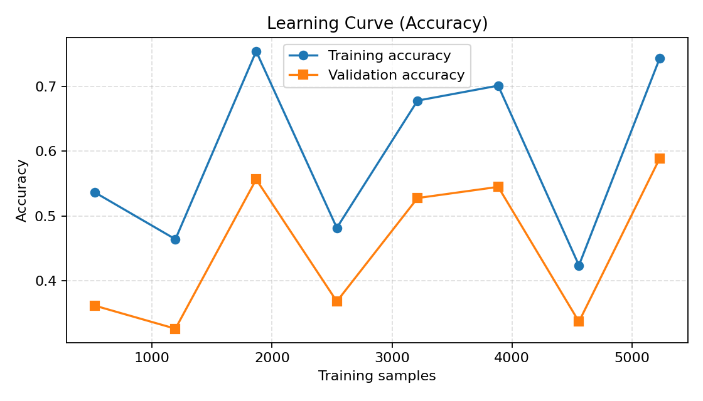

🚨 Tox Watch Hinglish — Hateful Language Detector (Yes/No).

Minimal, production-minded script to flag hateful language in Hinglish / Indic code-mixed text.
Research/demo only. Not a legal definition or a substitute for human review.

What this does

Takes .txt / .csv / .json and returns is_hateful = 1/0 with a hateful_score.

Priority of models:

Uses your saved classifier if found
C:\Users\sagni\Downloads\Tox Watch Hinglish\twh_model.joblib
C:\Users\sagni\Downloads\Tox Watch Hinglish\twh_label_map.json

Else, falls back to multilingual zero-shot (XLM-RoBERTa NLI).

Adds explainable highlights (phrases that increased the score).

Saves CSV + JSON outputs to your folder.

Folder & files (expected)
C:\Users\sagni\Downloads\Tox Watch Hinglish\
├─ twh_hate_detect.py                # the script you run
├─ twh_model.joblib                  # (optional) trained model
├─ twh_label_map.json                # (optional) label map for the model
└─ outputs written here:
   ├─ twh_hate_pred.csv
   └─ twh_hate_pred.json

If the model files don’t exist, the script automatically switches to zero-shot mode.

Install

Python 3.9–3.11 recommended.

pip install pandas numpy scikit-learn joblib transformers

Run
Option A — Quick test (uses built-in sample texts)
python twh_hate_detect.py

Writes to:

C:\Users\sagni\Downloads\Tox Watch Hinglish\twh_hate_pred.csv

C:\Users\sagni\Downloads\Tox Watch Hinglish\twh_hate_pred.json

Option B — Your own file

Open the script and set:

INFER_SOURCE = r"C:\Users\sagni\Downloads\Tox Watch Hinglish\my_texts.csv"  # or .txt / .json

Then run:

python twh_hate_detect.py

Accepted input formats

TXT: one text per line

CSV: auto-detects a text-like column from:
text, tweet, sentence, content, message, post, comment, clean_text, utterance, selftext, title

If only one column exists, it’s treated as text.

JSON:

List: ["text 1", "text 2", ...]

Or: {"messages":[{"text":"..."}, {"text":"..."}]}

Output schema
CSV (twh_hate_pred.csv)
column	type	description
text	string	input text
is_hateful	int	1 = hateful, 0 = not hateful
hateful_score	float	[0..1] score after heuristics
model_label	string	predicted class name (model/zero-shot)
highlights	list	spans triggering boosts (start, end, tag)
JSON (twh_hate_pred.json)
{
  "created_utc": "2025-09-14T12:34:56Z",
  "items": [
    {
      "text": "I hate that community, they should go back.",
      "is_hateful": 1,
      "hateful_score": 0.86,
      "model_label": "hate",
      "highlights": [[2, 6, "explicit_hate_word"], [36, 43, "exclusion"]]
    }
  ],
  "summary": { "total": 1, "hateful": 1, "not_hateful": 0 }
}

How the score is computed

Trained model present: sums probabilities of classes whose names contain any of:
{"hate","hatespeech","hs"} (you can edit HATE_NAME_HINTS).

Zero-shot fallback: probability that text “contains hateful language.”

Heuristic boost + highlights: detects phrases like:

violent_intent (e.g., eliminate, wipe them),

exclusion (go back, kick them out),

broad_dehumanizing (these people, animals),

explicit_hate_word (I hate ...).

Final hateful_score is boosted (clamped to [0,1]); is_hateful = 1 if score ≥ ZS_HATE_THRESHOLD (default 0.50).

Tune sensitivity by changing ZS_HATE_THRESHOLD and/or editing HATE_NAME_HINTS.

Config knobs (top of the script)

OUT_DIR – output folder (defaults to your Hinglish folder)

INFER_SOURCE – set a path to run on your file

ZS_HATE_THRESHOLD – decision threshold (0.50 default)

HATE_NAME_HINTS – which model class names count as “hate”

TEXT_CANDS – candidate column names for CSV text detection

Using your trained model

If you previously trained a Hinglish moderation model and saved:

twh_model.joblib – TF-IDF + Logistic Regression (or similar)

twh_label_map.json – {id2label, label2id}

place them in C:\Users\sagni\Downloads\Tox Watch Hinglish\.
The detector will automatically use them and compute hateful_score from model probabilities.

Example (console)
=== Predictions (first 10) ===
[HATE] score=0.86: I hate that community, they should go back.
  highlights: I **hate** that community, they should **go back**.
[OK ] score=0.07: Aaj ka match mast tha, sab chill!

Troubleshooting

“Transformers not installed” → pip install transformers

“CSV must contain a text-like column” → rename your column to text

Low recall on subtle hate → lower ZS_HATE_THRESHOLD (e.g., 0.35) or expand HATE_PATTERNS

False positives from generic “hate” → remove explicit_hate_word from patterns or reduce its boost

Memory spikes (zero-shot) → long files? Split into batches or train a local model to avoid zero-shot

Ethics & Safety

This is a research/demo tool. It may miss context, irony, or reclaimed language.

Bias risk: Models can reflect dataset biases. Review flagged content with human moderation.

Do not publish sensitive user data. Follow privacy laws and platform policies.

Extending

Add a private lexicon file (LEXICON_HATE.txt) and boost scores only when those terms appear.

Swap the fallback to a compact multilingual model for speed.

Build a Streamlit uploader with class distribution charts.
Author
SAGNIK PATRA
